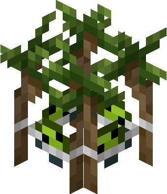

::: warning
This mod has no localization and relies heavily on the use of English for major story elements.
Your experience may be significantly diminished if you are not a fluent speaker.
:::

Congratulations! You've found yourself at the website of Gorp's World, a Minecraft mod that aims to add Gorp to the game.
This is a mod that introduces new and inventive combat, gameplay, and traversal mechanics.

# Who is Gorp?

**Gorp**

The star of the show is this green, lovable, bean-shaped creature named Gorp. Despite his handsome charm, Gorp isn't food. Instead, he is a multi-purpose consumable made of biological organic matter. This means Gorp is alive!

# Your First Steps

**Gorp Seed**

Before you can cultivate and grow your first Gorp, you have to find and plant a Gorp Seed.

::: info

</img>
**Gorp Sprout**

Gorp Sprouts will drop a few Gorp Seeds when broken. They generate in green grassy biomes.
:::

**Gorp Plant**

After a few moments, the Gorp Seed you placed will grow into a beautiful Gorp Plant.
Harvest it, and you've grown your very own Gorp!

# Now What?

At first, you may be tempted to eat your Gorp friend. Should you wish to do this, Gorp will immediately reject you and fall out of your hands.

**But I thought you said Gorp was consumable?**
 

**Bitten Gorp**

He is! Bitten Gorps are used in nearly every crafting recipe this mod includes. 

