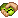

::: warning ATTENTION
This page is unfinished! Don't look!!! You'll spoil the surprise!
:::
::: danger SPOILERS AHEAD
From this point forward, the mod will try to help you progress through the story in-game via chat messages as shown below. This page serves as a more thoroughly explained guide on how to proceed in Gorp's World.
:::

# Chapter 1: Ready, Set, Gorp

After getting to know your Gorp, the thought that he slightly resembles a bean occurs to you. On an impulse, you try to take a bite of the squishy green creature. Suddenly, you are stricken by intense nausea and a taste certainly unbefitting of food is left in your mouth. As you come to, you realise your hand is empty. Hold on, you didn't intend on dropping Gorp. In fact, you were sure you had a tight hold on him! Perhaps it was no accident that you dropped him.

## Gorpcess Denied

<pre class="shiki" style="--shiki-dark:#e1e4e8;" tabindex="0" dir="ltr"><code>&lt;Player&gt; Nausea alert! I don't think that was an ordinary legume.
&lt;Player&gt; I wonder if I'll have any dreams about this...</code></pre>

When you try to eat Gorp, you will drop all the Gorps in your inventory and a message will appear saying "You don't have permission to do that. You will only be inflicted with nausea the first time.

## Mythical Gorpiphany

<pre class="shiki" style="--shiki-dark:#e1e4e8;" tabindex="0" dir="ltr">
<code>&lt;Player&gt; I had the strangest dream last night!
&lt;Player&gt; That weird green thing said something to me...
&lt;Player&gt; That "the <a href="./items/#armor" style="--shiki-dark:#ade344;" title="The green little fella!">Gorp Altar</a> is the key."
&lt;Player&gt; What could it mean?</code></pre>

After attempting to bite Gorp, the player should sleep in a bed. Upon waking from your dream, you're left with a message from Gorp and the crafting recipe for a Gorp Altar.

## Altar Be Thy Gorp

<pre class="shiki" style="--shiki-dark:#e1e4e8;" tabindex="0" dir="ltr">
<code>&lt;Player&gt; Crafting that <a href="./items/#armor" style="--shiki-dark:#ade344;">Gorp Altar</a> really tuckered me out!
&lt;Player&gt; I should sleep in case I dream about <a href="./items/#armor" style="--shiki-dark:#ade344;">Gorp</a> again...</code></pre>

Placing a Gorp Altar will cause you to have another Gorp related dream the next time you sleep.

## Gorp Speaks

<pre class="shiki" style="--shiki-dark:#e1e4e8;" tabindex="0" dir="ltr">
<code>&lt;Player&gt; <a href="./items/#armor" style="--shiki-dark:#ade344;">Gorp</a> appeared in my dream again! He seemed friendlier this time.
&lt;Player&gt; I can still hear an echo in my head, as if it were a call to action...
&lt;Player&gt; "Let me eat your gorpy layer."
&lt;Player&gt; Is this what I think it means?</code></pre>

Once you can figure out that you need to place a Gorp in the Gorp Altar, you will have another dream. This time, the message includes a key phrase that you can type into the Gorp Altar.

## Permission Gorped

<pre class="shiki" style="--shiki-dark:#e1e4e8;" tabindex="0" dir="ltr">
<code>&lt;<a href="./items/#armor" style="--shiki-dark:#ade344;">Gorp</a>&gt; Bite my shiny metal ass!
&lt;Player&gt; Ok I'll</code></pre>

You have just unlocked access to the entirety of Gorp's World! Now that you can create Bitten Gorps, you can craft various Gorp items.

# Chapter 2: Gorp's World

## A Step Into the Gorp <Badge type="tip" text="Updated" />

# Chapter 3: A Gorpdid Affair
