

## Tools & Weapons

<container class="item-showcase">
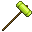</img>
<strong>Gorp Hammer</strong>
</container>

---

<container class="item-showcase">
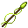</img>
<strong>Gorp Spear</strong>
</container>

---

<container class="item-showcase">
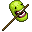</img>
<strong>Gorp Staff</strong>
</container>

---

<container class="item-showcase">
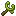</img>
<strong>Glingshot</strong>
</container>

## Armor

**Gorp Respirator**

</img>

---

**I Love Gorp T-Shirt**

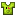</img>

---

**Gorp Pajamas**

</img>

---

**Impact Dampening Gorp Boots**

</img>

---

## Food and Consumables

**Jorp Juice**

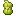</img>

---

**Roasted Gorp Seed**

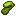</img>

---

**Consolidated Gorp Cube**

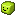</img>

---

### Elemental Gorps

**Spicy Gorp**

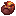</img>

---

**Icy Gorp**

</img>

---

<container class="item-showcase">
</img>
<strong>Dicey Gorp</strong>
</container>

## Crafting Materials

<container class="item-showcase">
</img>
<strong>High Quality Gorp Fabric</strong>
</container>

---

<container class="item-showcase">
</img>
<strong>Gorpium</strong>
</container>

These are found in clusters of Gorpolite.

## Special Items

<container class="item-showcase">
</img>
<strong>Gorpophone</strong>
</container>

---

<container class="item-showcase">
</img>
<strong>Gorpasol</strong>
</container>

---

<container class="item-showcase">
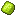</img>
<strong>Gorp Rift Bioconduit</strong>
</container>

---

<container class="item-showcase">
</img>
<strong>Gorp Coin</strong>
</container>

---

<container class="item-showcase">
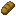</img>
<strong>Suspicious Bread</strong>
</container>

I mean I *think* it's just bread...?
