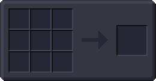

## Weapons

  

    </img>
    
      {{ item.name }}
      {{ item.summary }}
    
  

  

    <h5>Crafting Recipe</h5>
    </img>
    </img>
  

## Tools

  

    </img>
    
      {{ item.name }}
      {{ item.summary }}
    
  

## Armor

  

    </img>
    
      {{ item.name }}
      {{ item.summary }}
    
  

## Food and Consumables

  

    </img>
    
      {{ item.name }}
      {{ item.summary }}
    
  

### Elemental Gorps

  

    </img>
    
      {{ item.name }}
      {{ item.summary }}
    
  

  

    
    </img>
    
      Upgraded Dicey Gorp
      Grants better effects than a regular Dicey Gorp.
    
  

## Crafting Materials

  

    </img>
    
      {{ item.name }}
      {{ item.summary }}
    
  

